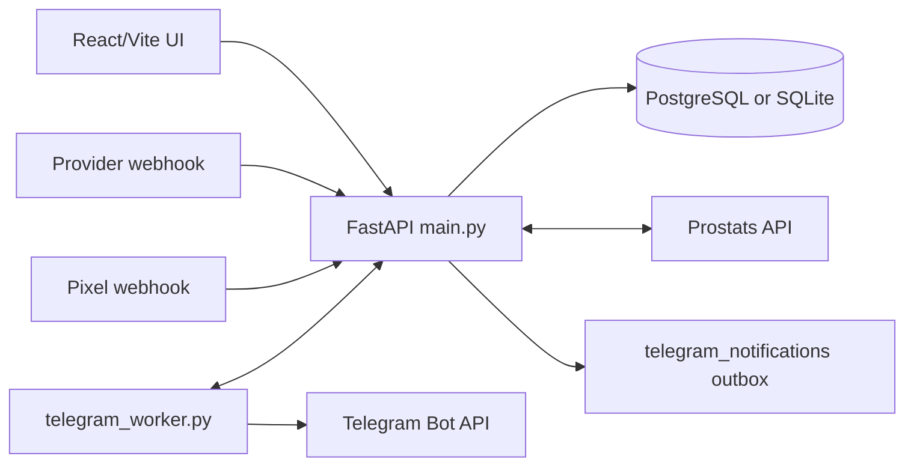

# Архитектура MB_LK_leads

## Назначение и границы

`MB_LK_leads` — личный кабинет для управления клиентами, проектами и лидами. Это единое приложение с React/Vite frontend и FastAPI backend, а не набор независимых сервисов. Backend хранит операционные данные, управляет проектами у поставщика Prostats, принимает provider/Pixel webhooks и ставит Telegram-уведомления в outbox. Отдельный `telegram_worker.py` доставляет outbox в Telegram через HTTPS API backend.

Подтверждённые контуры:

- React 19 + TypeScript + Vite: `my-app-vite/src/`.
- FastAPI + SQLAlchemy: `backend/app/`.
- Хранилище: `DATABASE_URL`; код поддерживает PostgreSQL и локальный SQLite fallback.
- Админская аналитика: изолированный пакет `backend/app/lead_analytics/`, отдельная SQLite-база и файлы в `LEAD_ANALYTICS_DATA_DIR` (по умолчанию `data/lead_analytics`).
- Внешние границы: Prostats, Telegram Bot API через внешний worker, Google Sheets через служебные export-скрипты.

В репозитории нет Docker/Compose, CI-конфигурации, отдельного backend test runner и формального мигратора. Не предполагайте их наличие.

## Карта исходников и источники истины

| Что меняется | Источник истины | Что ещё проверить |
| --- | --- | --- |
| HTTP API, зависимости и фоновые циклы | `backend/app/main.py` | `schemas.py`, `crud.py`, frontend `src/api.ts` |
| Данные, запросы и предметные правила | `backend/app/models.py`, `backend/app/crud.py` | startup schema-evolution в `main.py` |
| Вход и права | `backend/app/auth.py`, dependencies в `main.py` | все затронутые admin/agent/client endpoints |
| Проекты у Prostats | `backend/app/providers/prostats.py` | create/update/delete flows и local audit/operation events |
| Долговечные массовые операции проектов | `models.py` (`ProjectOperationJob`/`ProjectOperationItem`), `crud.py`, `project_operations_worker.py` | endpoints в `main.py`, Prostats adapter и frontend polling |
| Provider/Pixel XLSX import | `backend/app/provider_leads_xlsx_import.py` | preview/commit endpoints и `provider_leads` |
| Telegram outbox | `notifications.py`, `notify_worker.py`, `telegram_worker.py` | internal claim/result API и `telegram_notifications` |
| Экран и запросы frontend | `my-app-vite/src/App.tsx`, `my-app-vite/src/components/`, `my-app-vite/src/api.ts` | API responses, роли и lazy loading manager screens |
| Аналитика клиента и групп проектов | `backend/app/lead_analytics/` → `/admin/analytics` → `src/components/leadAnalytics/` | admin-only доступ, входные снимки, независимые группы, очередь и архив Excel |

`README.md` — только быстрый локальный запуск. `docs/` — runbook и продуктовый контекст; если они расходятся с кодом или конфигурацией, приоритет у кода.

## Доменные объекты и владение

- `User` и `ClientProfile`: пользователи, роли `admin`/`agent`/`client`, привязка клиента к агенту, настройки доступа и уведомлений.
- `Project`: локальная проекция проекта; хранит владельца, идентификатор у поставщика, источник, гео/контент, статусы и лимиты. Provider-проект связан с Prostats, Pixel-проект — исключение с доменным именем и `UNMAPPED` источником.
- `ProviderLead`: provider- или pixel-лид, привязанный к проекту, либо сохранённый непривязанным в provider-flow при проблемном матчинге.
- `ClientTariff` и `ClientTariffOperation`: тарифные остатки и пороги уведомлений; `ClientBalanceOperation` — отдельный legacy-балансный контур.
- `AuditEvent` хранит успешные проектные операции, а `ProjectOperationEvent` — неуспешные; не смешивайте их.
- `ProjectOperationJob` и `ProjectOperationItem` хранят выполняемые массовые provider-операции и их прогресс. Это не журнал аудита: незавершённые записи claim-ит фоновый worker, а временные ошибки переводятся в `waiting_retry`.
- `TelegramNotification` — долговечный outbox; `PixelTelegramReportState` отвечает за дедупликацию отчётов Pixel.

## Основные runtime-потоки

### UI и API

`src/main.tsx` запускает клиентское логирование и обработчик impersonation, затем рендерит `App.tsx`. `App.tsx` выбирает экран по локальному состоянию и lazy-loads тяжёлые admin/manager экраны. Браузер использует JWT; backend остаётся единственной границей авторизации.

### Проекты и Prostats

Создание, редактирование и удаление provider-проектов выполняются через `main.py` и `providers/prostats.py`, с локальной записью состояния и истории. UI display-коды `A`–`D` соответствуют raw-кодам `B1`–`B4`; raw-коды остаются контрактом API, БД, XLSX и Prostats. Pixel не должен получать этот mapping.

Критические правила:

- admin-only проверяется через `user.id == 1`; хранение роли `admin` само по себе не заменяет эту проверку.
- agent ограничен своими клиентами через `users.owner_agent_id`; UI-ограничения не являются защитой.
- не держите request-scoped DB session во время внешнего вызова Prostats или Telegram: используйте короткие read/write-сессии вокруг вызова.
- не превращайте неуспешные операции у поставщика в успешные `audit_events`.
- Массовые изменения provider-проектов, включая общую паузу/возобновление клиента, сначала фиксируются в БД и выполняются process-local worker-ом. Закрытие браузера не прерывает job; после перезапуска backend протухшая lease восстанавливается и job продолжается. Ответ операции содержит `items` с `projectId`, чтобы UI мог показать крутилку на участвующих проектах.
- Для одного клиента разрешена одна активная provider-job. Pixel-проекты в этот контур не входят. Клиент и агент получают только нейтральное сообщение «Сервис обработки данных»; техническая причина и название Prostats доступны только администратору и в безопасных логах.
- Статусные items обычных provider-проектов выполняются небольшими PostgreSQL batch до `PROJECT_OPERATIONS_CONCURRENCY` (по умолчанию `3`, диапазон `1..4`). SMS остаётся local-only, Pixel исключён, update/delete последовательны. После внешней записи статус подтверждается повторным чтением до локального commit; job с retry продолжает текущий проход последовательно.
- При общей паузе бизнес-блокировка проектов устанавливается до начала внешних вызовов и остаётся после завершения паузы. При возобновлении она снимается только когда snapshot восстановленных проектов опустел.

### Входящие лиды

`POST /api/provider-test/{secret}` принимает provider-payload. Он сопоставляет имя проекта сначала с неудалёнными проектами, затем с удалёнными в 48-часовом grace-окне. Неоднозначный или отсутствующий матч не должен ронять backend: provider-лид может сохраниться без `project_id`.

`POST /api/pixel-webhook/{secret}` — отдельный поток: сопоставление идёт по домену `site`; при `domain_not_found` или `domain_ambiguous` строка не создаётся. Дедупликация также различается: provider — `lead_source="provider"` и `vid`; Pixel — `lead_source="pixel"`, `vid` и телефон. Операционная дата для кабинета, отчётов и дашбордов — `imported_at`, не `prov_created_at`.

### XLSX preview/commit

Админские import endpoints используют общий модуль `provider_leads_xlsx_import.py`. Preview сохраняет временные файлы и state в локальной temp-директории процесса; commit разрешён только тому же админу и только с валидным `previewId`. Неоднозначная или отсутствующая привязка проекта блокирует commit. Следствие: без sticky session preview и commit на разных инстансах не работают.

### Аналитика

Экран «Аналитика» загружается лениво и доступен только `user.id == 1`; backend
проверяет администратора на каждом endpoint `/admin/analytics`, включая
скачивание. Это модуль текущего backend, а не отдельный сервис. Основная БД
предоставляет клиентов, проекты и идентификации только для чтения; её схема не
меняется. Внутренний XLSX повторно использует представление строк выгрузки ЛК,
без HTTP-вызова экспорта и без записи в обычную историю отчётов.

Группы аналитики независимы от групп дневных лимитов и используют конкретные
ID проектов. Допускаются пересечения групп, Pixel и удалённые проекты. Новые
проекты не добавляются автоматически. Расформирование группы архивирует её,
сохраняя историю. Статусы и настройки привязаны к стабильному ключу группы,
отдельному от отображаемого имени; начальных правил и эвристики email нет.
Расчёты и содержимое Excel перенесены из Lead Analytics.

Отдельное хранилище сохраняет входные снимки, настройки, задания и готовые
отчёты. Завершённый отчёт не пересчитывается при изменении источника или группы;
повторный анализ создаёт новую запись. Скачивание использует Authorization,
JWT в URL не передаётся. Backup должен включать SQLite и каталог файлов вместе.

Очередь анализа последовательная, с одним process-local worker. Поддерживается
один backend-процесс: при startup ожидающие задания продолжаются, прерванные
помечаются ошибкой без автоматического повторного анализа. Подробная настройка
и backup описаны в `docs/lead-analytics.md`.
Подготовка через Agent API также защищена process-local lock: параллельный
запрос получает RUN_BUSY, пока идёт чтение источника и постановка match job.

### Operational interface для AI-агентов

`lkctl` (`backend/app/agent_cli.py`) обращается по localhost HTTP к изолированному
`/agent/v1/*` в текущем backend. Контур `backend/app/agent_api/` использует
отдельные environment-токены со scopes read/compute; человеческие JWT и
`user.id == 1` не являются machine identity. Без настроенных токенов доступ
закрыт. Read-операции переиспользуют CRUD-агрегаты и возвращают безопасные
проекции, без сырых лидов и клиентских файлов.

`analytics.plan` проверяет сохранённые настройки и новые проекты с точными
LR-маркерами группы. Compute повторно читает настроенную Google-таблицу,
готовит снимки и ставит сопоставление, затем анализ в существующую очередь.
Новые проекты добавляются только явным подтверждением; новые статусы получают
категории только из явного ответа оператора. `analytics.prepare` принимает
один период или упорядоченный список периодов (до 64, включая пересекающиеся);
точный список сохраняется в run, а повторный `analytics.run` сверяет его при
передаче. Колонки не угадываются и настройки источника через Agent Interface не меняются. `analytics.download` требует
compute-доступа и выдаёт только зарегистрированный Excel конкретного отчёта;
файл может содержать строки лидов, поэтому обычный read-доступ его не получает.
Человекочитаемое имя отчёта строится одинаково для UI и Agent API по группе,
сохранённому исходному листу клиента и датам периода; при нескольких окнах
имя содержит `_по-периодам`.
Новый worker или БД не добавлены. Журнал `app.agent`
содержит capability/scope, безопасные параметры, outcome, duration и request id.
Настройка localhost, токенов и закрытие маршрута Nginx: `docs/agent-operations.md`.

### Уведомления и периодические проверки

Backend кладёт сообщения в `telegram_notifications`; Bot API вызывает только отдельный `telegram_worker.py`, который claim-ит сообщения и сообщает результат через защищённые internal endpoints. Startup в `main.py` запускает daemon threads для outbox, долговечных project jobs, тарифных/лимитных проверок, Pixel-отчётов, очистки outbox и проверки B4 operator block. Project worker использует DB lease и допускает восстановление после падения процесса; остальные расписания остаются process-local. Эти потоки создаются в каждом процессе backend; масштабирование несколькими процессами требует проверки дедупликации и расписаний.

Дневной лимит проекта и остаток клиентского тарифа — независимые контуры. Не заменяйте один другим; проверка лимитов не запускается непосредственно на provider webhook.

## Устойчивые инварианты

- `WEBHOOK_SECRET` обязателен для старта backend; секрет Pixel отдельный.
- Серверные проверки preview/commit, прав, дедупликации и технических префиксов provider-проектов нельзя переносить только на frontend.
- Новые provider-проекты используют raw-префикс `B1_`…`B4_`; для клиентов с unique-name настройкой сохранённый internal prefix применяется только к новым проектам. Legacy-маркер `[MB{id}]` не удаляйте без отдельной миграции.
- `Блокировка оператора` — системный статус только для активных B4 при подтверждённом `status == 0` или пустом успешном ответе Prostats; не выставляйте его вручную и не распространяйте на B1–B3.
- `Архив` — ручной статус. Если проект был `Активен`, сначала выключается у поставщика; локальный `Архив` ставится только после успеха. В списках скрыт, пока не включён `includeArchived`. В агрегатах считается как `На паузе`. Удалённые проекты архивировать нельзя.
- Агрегаты dashboard и client summary рассчитываются на backend. Не пересчитывайте их из больших raw-списков в браузере.
- Полные history snapshots могут содержать чувствительные поля: list endpoints не должны возвращать расширенные `before`/`after` или `duplicateDiagnostics` клиентам и агентам.

## Карта влияния изменений

| Изменение | Затрагиваемые контуры |
| --- | --- |
| API payload/response | `schemas.py` → `main.py` → `src/api.ts` → компоненты и E2E, если сценарий покрыт |
| Модель/поле БД | `models.py` → `crud.py` → schema-evolution в `main.py` → API consumers |
| Права или impersonation | backend dependencies и manager-access helpers → все role-specific endpoints → frontend доступность |
| Provider project flow | validation → Prostats adapter → local persistence/audit → UI error handling |
| Массовая provider-операция | job/items schema → claim/retry worker → Prostats reconciliation → local persistence/audit → polling UI и role-aware сообщения |
| Provider/Pixel lead logic | webhook или import module → `provider_leads` → reports/dashboard/export/notification consumers |
| Telegram notification | creator → outbox CRUD → internal worker API → `telegram_worker.py` |
| Тяжёлый admin screen | lazy import в `App.tsx` → component → `src/api.ts`; не возвращайте статический runtime-import |

## Проверка и известные пробелы

Поддерживаемые frontend-проверки в `my-app-vite/package.json`: `npm run lint` и `npm run build`. Backend test runner, CI и migration tool не обнаружены.

Для нового контура аналитики добавлены целевые pytest-проверки
`tests/lead_analytics/` и зависимости `requirements-analytics-test.txt`;
`python -m pytest tests/lead_analytics -q` проверяет этот контур на искусственных
данных. Это не единый runner или покрытие всего backend. Frontend-проверки
аналитики используют существующий Playwright.

Архитектурные риски текущей реализации, а не обещания системы:

- Schema changes исполняются на import/startup через `create_all` и набор `ALTER TABLE`, поэтому их нужно проверять на целевой SQL dialect и на уже существующей БД.
- Временные XLSX previews не разделяются между инстансами.
- Фоновые daemon threads являются process-local; при нескольких backend workers их расписания повторяются.
- Project jobs сохраняются при остановке backend и продолжатся после запуска, но не выполняются, пока все backend-процессы выключены. Для непрерывной работы во время web-deploy worker потребуется вынести в отдельный процесс.
- Большая часть маршрутизации и бизнес-координации сосредоточена в `main.py` и `crud.py`; при изменении одного из них ищите связанных consumers, а не ограничивайтесь одной функцией.

Эта карта содержит только устойчивые связи. Детали единичных багов, конкретных инцидентов и пошаговые операции должны оставаться в `docs/`, а не добавляться сюда.
